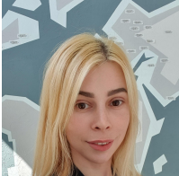

# Katerina (Katsiaryna) PIATRENKA  
   

|  |Email     |   *petrenka.katerina@gmail.com* 
---|---|:---
|  | Phone |*+420608823774*
|  | Date of birth   |  *Jun 28, 1988*
|  | Nationality   |   *Belarusian*
 

### **OBJECTIVE** ###
 ___
 
 I am passionate about my work. Because it brings me joy to know that I am useful, I am contributing to somthing more, I have a steady source of motivation that drives me to develop myself. For example, I'm interested in Automated testing and I study a programming language JavaScript.
 

 
 

 ### **EXPERIENCE** ###
  
 
 JSB Belinvestbank | EPAM System
  --- | ---
 Grodno, Belarus *Jul 2008 - Apr 2020* **Client relations manager  (account manager)**  | Grodno, Belarus *Jun 2021 - Sep 2021* **Manual Tester  (QA Engineer)** 
  

 ### **EDUCATION** ###
 

 Belarusian State Economic University | EPAM Training Center
  ---|---
  Minsk, Belarus *Sep 2008 - May 2013* **Finance and Credit (Banking)** | Grodno, Belarus *May 2021 - Jul 2021* **Junior Manual Tester**
  
 
### **SKILLS** ###    
- office work-business communication
- organization and performance of work at all stages of software testing
- Basics of databases (rules for writing SQL queries)
- Basics of testing Web services (Fiddler, Apache, jMeter)
- Basics knowledge of testing tools, automated testing (F12, Selenium)
- Knowledge of management, marketing and working with customer needs
 
 

### **LANGUAGES** ###
 

English |Polish |Russian |Czech
:---:|:---:|:---:|:---:
Intermediate | Intermediate | Native | Intermediate
